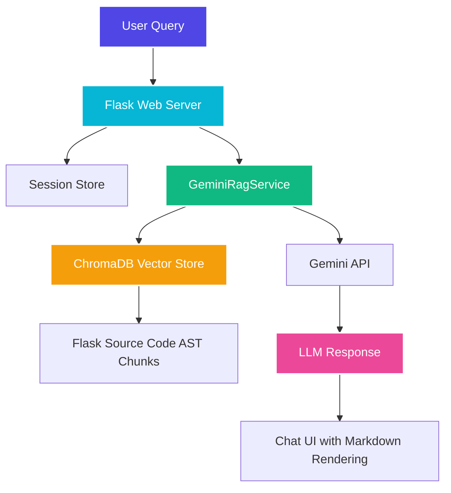

# Flask Framework Expert Assistant — RAG Chatbot
### BSE2301: Software Engineering Mini Project 2 — Recess 2026 (Group O)

A Retrieval-Augmented Generation (RAG) chatbot that answers questions about the **Flask web framework's source code**. The system uses a pre-built ChromaDB vector store containing AST-parsed chunks of Flask's codebase and a Gemini API LLM to produce grounded, source-aware answers.

---

## Table of Contents
1. Project Overview
2. Key Objectives
3. System Architecture
4. RAG Pipeline
5. Repository & Project Structure
6. Setup & Installation Instructions
7. Running the Application
8. Group Members & Contact Information

---

## Project Overview

Instead of a generic LLM answer about Flask, this chatbot retrieves relevant source-code chunks from Flask's actual codebase and injects them as context for the model. Every answer is grounded in real function signatures, class definitions, and module docstrings from the Flask repository. The application is built using Flask itself, demonstrating the framework's capabilities (Blueprints, sessions, SSE streaming, Jinja templates, etc.).

---

## Key Objectives
- **RAG Pipeline**: Embed user queries, retrieve top-K similar Flask source code chunks from ChromaDB, and feed them as context to the LLM.
- **Multi-Session Chat**: Allow users to create, switch between, and delete independent chat sessions with per-session history.
- **Streaming & Title Generation**: Stream LLM responses token-by-token via SSE and auto-generate concise session titles from the first user message.
- **Light/Dark Theme**: Professional light and dark themes with a toggle button and system preference detection.
- **Responsive Design**: Collapsible sidebar for desktop, slide-over drawer for mobile.

---

## System Architecture



---

## RAG Pipeline

1. **Query Embedding**: User question is embedded via `gemini-embedding-001`.
2. **Vector Search**: The embedding queries the ChromaDB collection (`flask_code`, 411 chunks) for the top-5 most similar source snippets.
3. **Context Assembly**: Retrieved snippets are formatted with file paths and symbol names into a prompt context block.
4. **LLM Generation**: The context, conversation history (last 6 turns), and system prompt are sent to `gemini-flash-latest` (Gemini 3.6 Flash).
5. **Response Delivery**: The full response is returned (or streamed) and rendered as Markdown in the chat UI.

---

## Repository & Project Structure

```text
├── chroma_db/                   # Pre-built vector store (Flask source AST chunks)
├── src/                         # Flask web service codebase
│   ├── app.py                   # Flask app factory entrypoint
│   ├── config.py                # Configuration & env loading
│   ├── domain/
│   │   └── entities.py          # Domain entities (ChatMessage)
│   ├── interfaces/
│   │   └── gateways.py          # LlmServiceGateway interface
│   ├── infrastructure/
│   │   ├── llm/
│   │   │   └── gemini_service.py  # GeminiRagService (RAG + LLM)
│   │   ├── session_store.py     # In-memory session storage
│   │   └── web/
│   │       ├── app_setup.py     # Factory bootstrap
│   │       └── routes.py        # Session CRUD, chat, streaming endpoints
│   ├── static/
│   │   ├── css/
│   │   │   └── main.css         # Professional light/dark theme styles
│   │   └── js/
│   │       └── chat.js          # Multi-session chat, Markdown render, copy buttons
│   └── templates/
│       └── index.html           # Single-page chat interface
├── requirements.txt             # System dependencies
└── README.md                    # Project documentation (this file)
```

---

## Setup & Installation Instructions

### Prerequisites
- Python 3.10 or higher
- Pip (Python Package Installer)
- Virtual Environment tool (venv)

### Step-by-Step Installation
1. **Clone the Repository**:
   ```bash
   git clone <your-repository-url>
   cd Year-2-Recess
   ```

2. **Create and Activate a Virtual Environment**:
   ```bash
   python3 -m venv venv
   source venv/bin/activate  # On Windows: venv\Scripts\activate
   ```

3. **Install Dependencies**:
   ```bash
   pip install --upgrade pip
   pip install -r requirements.txt
   ```

4. **Set Up Environment Variables**:
   Create a .env file in the root directory:
   ```env
   GEMINI_API_KEY=your_gemini_api_key_here
   FLASK_APP=src/app.py
   FLASK_DEBUG=True
   SECRET_KEY=your_secret_flask_key_here
   ```

---

## Running the Application

### Start the Flask Server
```bash
flask run
```
Open your browser and navigate to `http://127.0.0.1:5000/`.

---

## Security

- Keep real credentials only in a local `.env` file; it is excluded from version control.
- GitHub Actions runs TruffleHog on every push, pull request, and manual workflow dispatch to detect exposed credentials. See the [TruffleHog GitHub Action documentation](https://github.com/trufflesecurity/trufflehog#-trufflehog-github-action) for scan behaviour and configuration.
- If a credential is exposed, revoke or rotate it immediately; removing it from a later commit does not invalidate it.

## Code formatting

Python code is formatted and linted with Ruff. Run `ruff format src` to apply formatting locally, then `ruff check src` to check basic errors. GitHub Actions enforces both checks on every push and pull request. See the [Ruff formatter documentation](https://docs.astral.sh/ruff/formatter/) for editor setup and behaviour.

---

## Group Members & Contact Information
We are Group O for BSE2301 Mini Project 2

| Member | Registration Number |
| --- | --- |
| OTAI JOSEPH| 24/U/23001 |
| AKATUKUNDA PRECIOUS PRAISE | 24/U/0147 |
| ABUREK EMMANUEL | 24/U/02614/PS |
| Member 4 | Enter registration number |
| Member 5 | Enter registration number |

For inquiries, support, or class supervisions, please contact:
*   Email: jeff.geoff.mis@gmail.com
*   CC: ndigezzalivingstone2@gmail.com
*   GitHub Repository Link: [Repository](https://github.com/Josemiles-ctr/Year-2-Recess-Project)
