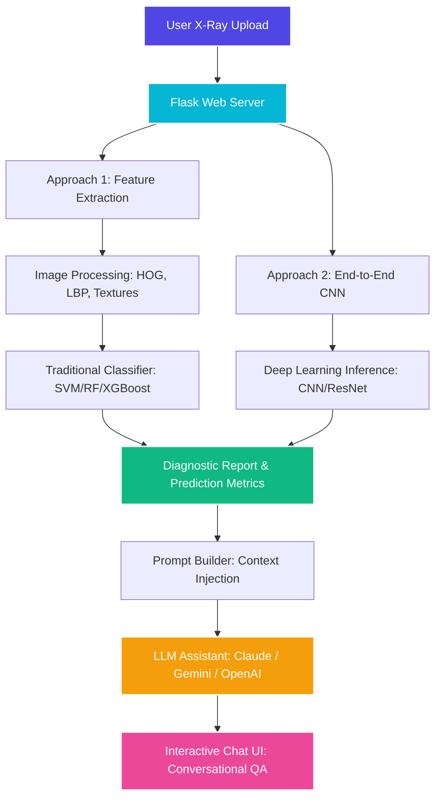

# AI-Powered X-Ray Cancer Predictor & LLM Diagnostic Assistant
### BSE2301: Software Engineering Mini Project 2 — Recess 2026 (Group O)

An AI-powered web service built using Flask that predicts the presence of cancer in chest/body X-ray scan images. The system goes beyond binary classifications by extracting detailed radiological findings and transferring them to a Large Language Model (LLM). This establishes an intelligent system capable of responding to user/clinician queries with context-aware, detailed diagnostic reasoning.

---

## Table of Contents
1. Project Overview
2. Key Objectives
3. System Architecture
4. Machine Learning Approaches
5. LLM Integration & Interactive System
6. Repository & Project Structure
7. Academic Requirements Checklist
8. Setup & Installation Instructions
9. Running the Application
10. Group Members & Contact Information

---

## Project Overview
Traditional medical image classification services return a simple "Yes/No" or probability score. This project builds a comprehensive, double-engineered diagnostic pipeline comparing traditional Feature Extraction (paired with Machine Learning classifiers) and Deep Learning (CNN) approaches. 

Furthermore, to mimic real-world clinical assistant applications, the diagnostic outcome, feature weights, confidence metrics, and image characteristics are serialized and injected into an LLM context. This allows patients or clinicians to ask follow-up questions about the prediction and obtain rich, contextual, and understandable responses instead of a bare label.

---

## Key Objectives
- **Data Exploration & Cleaning**: Identify missing features, apply robust imputations/handling strategies, and document the dataset before and after preprocessing.
- **Dual-Model ML Pipeline**:
  - **Approach A (Feature-based ML)**: Apply image processing to extract texture, shape, and intensity features (e.g., Haralick textures, HOG, LBP), then train classifiers (Random Forest, SVM, or XGBoost).
  - **Approach B (Deep Learning CNN)**: Train an end-to-end Convolutional Neural Network (such as ResNet or custom CNN) directly on the raw X-ray scans.
- **Model Evaluation**: Compare performance under real-world computational and data constraints using cross-validation.
- **LLM Integration**: Feed structured diagnostic reports into an LLM to facilitate subsequent questions and natural language explanations.
- **Interactive Flask Web App**: Develop a clean, responsive, and modern user interface to upload scans, view prediction confidence, compare model metrics, and chat with the AI diagnostic assistant.

---

## System Architecture



---

## Machine Learning Approaches

### Approach 1: Image Processing + Traditional ML
This approach focuses on hand-crafted features which are computationally efficient and interpretable:
1. **Preprocessing**: Grayscale conversion, histogram equalization (CLAHE), and bilateral filtering for noise reduction.
2. **Feature Extraction**:
   - **Local Binary Patterns (LBP)**: Captures fine micro-textures and lesion patterns.
   - **Histogram of Oriented Gradients (HOG)**: Evaluates edge orientations and shapes of abnormalities.
   - **Gray-Level Co-occurrence Matrix (GLCM)**: Measures contrast, correlation, energy, and homogeneity.
3. **Classification**: Trained on classifiers such as Support Vector Machines (SVM), Random Forest, and Gradient Boosting (XGBoost).

### Approach 2: Deep Learning (End-to-End CNN)
This approach leverages deep neural networks to automatically discover spatial hierarchies and complex feature mappings from raw pixels:
1. **Model**: Custom CNN architecture or Transfer Learning using standard backbones like ResNet-50 or MobileNetV2.
2. **Training**: Optimization using Adam, categorical cross-entropy loss, data augmentation (rotations, zooms, flips), and dropout regularization to prevent overfitting.
3. **Output**: Heatmap activations (Grad-CAM) to identify regions of high cancer probability, and a final classification probability score.

---

## LLM Integration & Interactive System
Once a prediction is generated, the application compiles an analysis context envelope:
```json
{
  "prediction": "Malignant / Suspicious",
  "confidence_score": 0.892,
  "detected_nodules": 2,
  "texture_homogeneity_score": 0.12,
  "cnn_activation_density": "high",
  "recommended_follow_up": "Biopsy and CT correlation"
}
```
This payload is injected dynamically into the system prompt of the conversational agent. When a user asks: "What does my result mean?" or "What features led to this decision?", the LLM retrieves this structured context and explains the machine learning metrics in natural language, enabling a reassuring and clear conversation.

---

## Repository & Project Structure
The repository is divided into two primary directories reflecting the academic grading rubrics:

```text
├── data/                       # Dataset placeholder (raw images and clinical metadata)
├── notebooks/                  # Part A: Data Science & Machine Learning notebooks
│   ├── exploratory_analysis.ipynb # Tasks 1-9: Preprocessing, Imputation, & Visualizations
│   └── model_training.ipynb       # Tasks 10-12: Training, Cross-Validation, & Comparison
├── src/                        # Part B: Flask Web Service codebase
│   ├── app.py                  # Main Flask App entrypoint
│   ├── config.py               # Configuration & API Key management
│   ├── models/                 # Pre-trained models (weights and pipelines)
│   │   ├── classifier.pkl      # Approach 1: Traditional ML pipeline
│   │   └── cnn_model.h5        # Approach 2: Deep Learning CNN weights
│   ├── utils/                  # Helper modules
│   │   ├── feature_extractor.py# Image processing features code
│   │   └── llm_helper.py       # LLM api calling and context injection
│   ├── static/                 # Frontend assets (CSS, JS, Images)
│   │   ├── css/
│   │   │   └── main.css        # Premium custom styles (Glassmorphism & animations)
│   │   └── js/
│   │       └── chat.js         # Interactive Chat & upload behavior
│   └── templates/              # HTML layout files
│       ├── index.html          # Upload and dashboard home
│       └── report.html         # Interactive LLM Diagnostic report
├── requirements.txt            # System dependencies
└── README.md                   # Project documentation (this file)
```

---

## Academic Requirements Checklist

### PART A: Data Science & Machine Learning (10-Page Report & Code)
- [ ] **Introduction**: Clear description of the dataset and project objectives.
- [ ] **Task 1 & 2**: Identify missing values, calculate percentages, and justify handling methods (imputation vs. deletion).
- [ ] **Task 3**: Implement cleaning/imputation, evaluating its effect on dataset size and distribution.
- [ ] **Task 4 & 5**: Identify features and execute feature engineering (e.g., LBP/HOG extraction).
- [ ] **Task 6**: Evaluate feature engineering's impact on classifier performance.
- [ ] **Task 7 & 8**: Create visualizations using Matplotlib, Seaborn, and Plotly (heatmaps, scatter plots, 3D charts).
- [ ] **Task 9**: Interpret plots to extract patterns and diagnostic features.
- [ ] **Task 10 & 11**: Split data, train modules, perform cross-validation, and log evaluation metrics (F1-score, ROC-AUC).
- [ ] **Task 12**: Summarize conclusions, actionable insights, and recommendations.

### PART B: Web Development with Flask (10-Page Report & Web App)
- [ ] **Introduction & Architecture**: Detailed breakdown of the Flask web service.
- [ ] **Interactive Upload & Run**: Page to upload X-ray images, preprocess, and execute dual model inference.
- [ ] **Visual Dashboard**: Displays predictions, confidence levels, and comparison charts between Approach 1 and Approach 2.
- [ ] **LLM Chatbot**: A chat window with context injected, enabling subsequent patient/doctor questions.
- [ ] **Report & Screenshots**: Annotated system documentation with functional screenshots.

---

## Setup & Installation Instructions

### Prerequisites
- Python 3.10 or higher
- Pip (Python Package Installer)
- Virtual Environment tool (venv)

### Step-by-Step Installation
1. **Clone the Repository**:
   ```bash
   git clone <your-repository-url>
   cd Year-2-Recess
   ```

2. **Create and Activate a Virtual Environment**:
   ```bash
   python3 -m venv venv
   source venv/bin/activate  # On Windows: venv\Scripts\activate
   ```

3. **Install Dependencies**:
   ```bash
   pip install --upgrade pip
   pip install -r requirements.txt
   ```

4. **Set Up Environment Variables**:
   Create a .env file in the root directory:
   ```env
   FLASK_ENV=development
   SECRET_KEY=your_secret_flask_key_here
   LLM_API_KEY=your_gemini_or_openai_api_key_here
   ```

---

## Running the Application

### Start the Flask Server
Run the web application locally:
```bash
python src/app.py
```
Open your browser and navigate to http://127.0.0.1:5000/.

---

## Security

- Keep real credentials only in a local `.env` file; it is excluded from version control.
- GitHub Actions runs TruffleHog on every push, pull request, and manual workflow dispatch to detect exposed credentials. See the [TruffleHog GitHub Action documentation](https://github.com/trufflesecurity/trufflehog#-trufflehog-github-action) for scan behaviour and configuration.
- If a credential is exposed, revoke or rotate it immediately; removing it from a later commit does not invalidate it.

## Code formatting

Python code is formatted and linted with Ruff. Run `ruff format src` to apply formatting locally, then `ruff check src` to check basic errors. GitHub Actions enforces both checks on every push and pull request. See the [Ruff formatter documentation](https://docs.astral.sh/ruff/formatter/) for editor setup and behaviour.

---

## Group Members & Contact Information
We are Group O for BSE2301 Mini Project 2

| Member | Registration Number |
| --- | --- |
| OTAI JOSEPH| 24/U/23001 |
| AKATUKUNDA PRECIOUS PRAISE | 24/U/0147 |
| ABUREK EMMANUEL | 24/U/02614/PS |
| Member 4 | Enter registration number |
| Member 5 | Enter registration number |

For inquiries, support, or class supervisions, please contact:
*   Email: jeff.geoff.mis@gmail.com
*   CC: ndigezzalivingstone2@gmail.com
*   GitHub Repository Link: [Repository](https://github.com/Josemiles-ctr/Year-2-Recess-Project)
